# Tracking Success — Personal Metrics Tracker

## Challenge

Building and maintaining healthy habits requires consistent tracking and visible progress. Existing habit-tracking apps are either too complex (fitness-oriented with dozens of irrelevant fields) or too simple (checkbox-only, no trend analysis). The challenge was to build a focused, personal metrics dashboard that tracks the specific habits and measurements that matter — sleep quality, exercise, fasting, weight, mood — with immediate visual feedback on success or failure, and long-term trend analysis.

## Our Approach

**Full-stack TypeScript/Python application with a mobile-first card-swipe interface.**

The app follows a clean three-tier architecture:

1. **Data Model** — A flexible `MetricConfig` + `MetricEntry` model supports multiple metric types (boolean, float, time-based) with configurable goals. Each metric has a calculation strategy (e.g., "sleep_duration" computes bedtime → waketime minus 1h fall-asleep buffer). Users can define custom metrics via YAML import/export.

2. **Backend (FastAPI + PostgreSQL)** — Async Python with SQLAlchemy 2.0. Pure calculation functions (`compute_sleep`, `compute_fasting`, `compute_weight_loss`) are separated from database logic for testability. JWT authentication with password reset. Streak calculation walks backwards from today counting consecutive successful days.

3. **Frontend (React + TypeScript + Tailwind)** — Mobile-first card-swipe UI with framer-motion animations. Each metric is a swipeable card with input fields, success/failure animations, and a mini line chart (Recharts). Time range selector toggles between 7-day, 30-day, and all-time views. Streak milestones (3, 7, 14, 30, 60, 90, 183, 365 days) trigger celebration animations.

4. **Infrastructure** — Docker Compose with PostgreSQL, FastAPI backend, React frontend, and Traefik reverse proxy. Deployed to Hetzner VPS via Hermine with Let's Encrypt SSL.

**Key technical decisions:**
- **SQLAlchemy async** — Non-blocking database access for responsive API under concurrent requests.
- **Pure calculation functions** — Sleep duration, fasting window, and weight-trend logic are pure Python functions with no database dependencies, making them trivially testable.
- **YAML configuration** — Metrics are defined as YAML, making it easy to share setups, version-control them, or switch between different tracking configurations.
- **Card-swipe navigation** — Touch-first UX with swipe detection that respects input fields (doesn't interfere with typing).
- **Recharts for visualization** — Lightweight, composable React charting library with responsive containers and "nice" axis tick calculations.

## Results & Impact

- **Fully deployed production app** at tracking-success.jonaskrauss.de, used daily
- **11 tracked metrics** covering sleep, exercise, fasting, weight, mood, focus, and habit compliance
- **Streak system** with milestone animations that reinforce consistency
- **Trend analysis** via interactive line charts with configurable time ranges
- **Mobile-optimized** card-swipe interface for quick daily input

## Visual Assets

**Live app:** https://tracking-success.jonaskrauss.de

**Features:**
- Card-swipe navigation between metrics
- Success/failure animations with confetti on streak milestones
- Line charts with 7d/30d/all-time toggle
- Summary card with today's overview
- YAML editor for metric configuration import/export

**Architecture:**

```mermaid
flowchart LR
    subgraph Frontend ["React Frontend"]
        direction TB
        F1["Card-Swipe UI\nSwipe, Input, Animations"]
        F2["Charts\nRecharts line graphs"]
        F3["Auth & Settings\nYAML editor"]
    end

    subgraph Backend ["FastAPI Backend"]
        direction TB
        B1["JWT Auth\nRegister, Login, Reset"]
        B2["Metric API\nCRUD, Streaks, History"]
        B3["Calculations\nSleep, Fasting, Weight"]
    end

    subgraph DB ["PostgreSQL"]
        direction TB
        D1[users]
        D2[metric_configs]
        D3[metric_entries]
    end

    Frontend <-->|"REST + JWT"| Backend
    Backend <-->|"Async SQLAlchemy"| DB

    style Frontend fill:#e8f5e9,stroke:#30974e
    style Backend fill:#e3f2fd,stroke:#1565c0
    style DB fill:#fce4ec,stroke:#c62828
```

## Tech Stack

**Backend:**
- Python 3.12, FastAPI, SQLAlchemy 2.0 (async), Pydantic v2
- PostgreSQL 16 (asyncpg driver)
- JWT authentication, bcrypt password hashing
- pytest for unit tests

**Frontend:**
- React 18, TypeScript, Vite
- Tailwind CSS, shadcn/ui components
- Framer Motion (animations), Recharts (charts)
- Lucide icons, js-yaml

**Infrastructure:**
- Docker Compose (Postgres + Backend + Frontend)
- Traefik reverse proxy, Let's Encrypt SSL
- Hetzner Cloud VPS, OpenTofu IaC
- GitHub Actions CI/CD

## Additional Context

- **Timeline:** Developed iteratively over ~2 weeks, with ongoing daily use and refinement
- **Team:** Solo developer (full-stack)
- **My role:** Architecture, backend, frontend, infrastructure, deployment
- **Status:** Production — actively used daily for personal habit tracking
- **Source:** [github.com/jkrauss/tracking-success.jonaskrauss.de](https://github.com/jkrauss/tracking-success.jonaskrauss.de)

---

*Built by [Jonas Krauss](https://jonaskrauss.de) · [LinkedIn](https://www.linkedin.com/in/kraussjonas/)*
