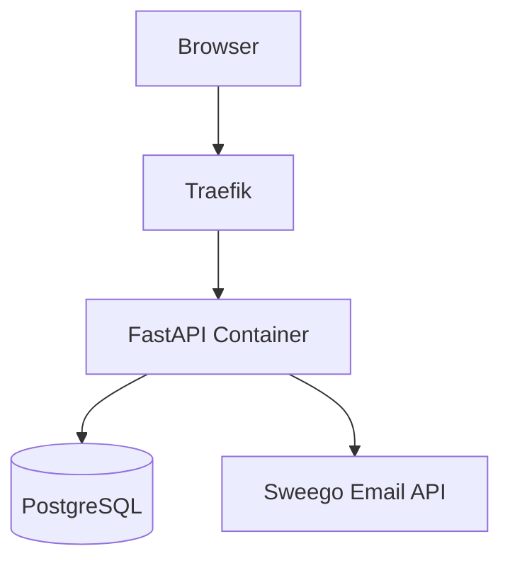

# tracking-success.jonaskrauss.de

Personal daily metrics tracker — track habits, moods, sleep, fasting, meditation, and more.

## Features

- 11 customizable metric types (bool, float, percent, sleep, fasting, meditation, work duration, weight)
- Goal tracking with streaks and celebrations
- Weekly charts and 30-day success rate
- Mobile-first, dark-mode UI
- Email-based auth with password reset
- YAML config export/import

## Stack

- **Backend:** Python 3.12, FastAPI, SQLAlchemy async, PostgreSQL
- **Frontend:** React 18, Vite, TypeScript, Tailwind CSS, shadcn/ui
- **Infra:** Docker Compose, Traefik, Let's Encrypt

## Development

```bash
# Backend
cd backend
pip install -e .
uvicorn app.main:app --reload

# Frontend
cd frontend
pnpm install
pnpm dev
```

## Testing

```bash
cd backend
DATABASE_URL="sqlite+aiosqlite:///tmp/test.db" \
JWT_SECRET=test-secret \
SWEEGO_API_KEY=test-key \
APP_BASE_URL=http://test \
python -m pytest -v
```

## Deployment

Managed via [Hermine](https://hermine.dev) DevOps operator.

| Environment | Domain | Server |
|-------------|--------|--------|
| Staging | tracking-success.stage.jonaskrauss.de | Hetzner CX22 |
| Production | tracking-success.jonaskrauss.de | Hetzner CX22 |

```bash
# Deploy staging
hermine deploy --env staging

# Deploy production
hermine deploy --env production
```

## Architecture

Single-container FastAPI app behind Traefik reverse proxy. PostgreSQL on host. Let's Encrypt TLS termination.



## License

Private — personal use only.
